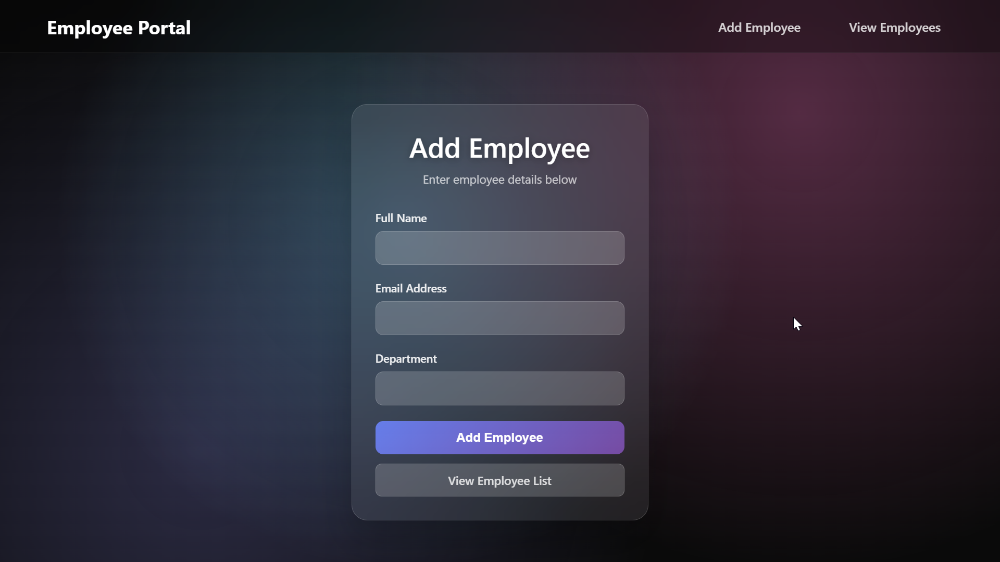
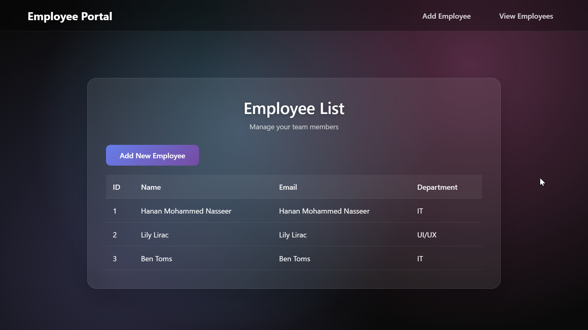

# Employee Management System

A modern Django web application for managing employee records with a beautiful glassmorphic UI design.

## ✨ Features

- **Add Employee**: Create new employee records with name, email, and department
- **View Employees**: Display all employees in a clean table format
- **Modern UI**: Glassmorphic design with dark theme and gradient backgrounds
- **Responsive**: Works on desktop and mobile devices
- **Clean Code**: Well-structured Django project with proper separation of concerns

## 🚀 Technologies Used

- **Backend**: Django 4.2.23
- **Frontend**: HTML5, CSS3 (Glassmorphic Design)
- **Database**: SQLite3
- **Python**: 3.9+

## 📱 Screenshots

### Employee Form

*Add new employees with the glassmorphic form design*

### Employee List

*View all employees in a beautiful table layout*

